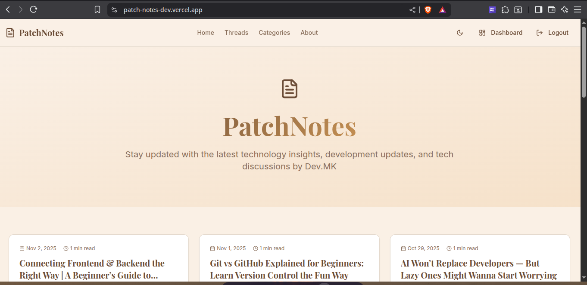

# 📝 PatchNotes

<div align="center">



**A tech blog and source code repository where code meets knowledge**

[](https://github.com/Kevrollin)
[](https://opensource.org/licenses/MIT)
[](https://reactjs.org/)
[](https://nodejs.org/)
[](https://github.com/Kevrollin/patch-note-sessions)

[📖 Blog Site](https://patch-notes-dev.vercel.app/) • [💬 WhatsApp](https://wa.me/254757086742) • [🐙 GitHub](https://github.com/Kevrollin) • [📧 Email](mailto:kelvinmukaria2023@gmail.com)

</div>

---

## 🎯 About PatchNotes

**PatchNotes** is both a **tech blog** and **source code repository** where I share hands-on learning experiences, real-world projects, and technical deep-dives. Each article comes with its own folder containing complete, runnable code examples—because the best way to learn is by doing.

Whether you're exploring full-stack integrations, diving into blockchain experiments, learning cybersecurity best practices, or building backend APIs, PatchNotes provides **code, context, and community** to help you grow as a developer.

**Created by:** [Kelvin Mukaria (KevDev)](https://github.com/Kevrollin) — Full stack Developer & Ethical Hacker passionate about helping devs learn by building.

---

## 🛠️ Tech Stack

| Category | Technologies |
|----------|--------------|
| **Frontend** | React, JavaScript (ES6+), HTML5, CSS3, React Hooks |
| **Backend** | Node.js, Express.js, RESTful APIs |
| **Database** | MongoDB, PostgreSQL, In-Memory (for demos) |
| **Blockchain** | Solidity, Web3.js, Ethereum, Smart Contracts |
| **Tools** | Git, npm, React Scripts, CORS, VS Code |
| **Languages** | JavaScript, TypeScript, Python, Solidity, SQL |

---

## 📁 Repository Structure

```
patch-note-sessions/
│
├── 📄 README.md                    # This file
├── 📂 session-1/                   # Article/Project 1
│   ├── 📂 users-backend/          # Express.js REST API
│   │   ├── server.js              # Backend server code
│   │   ├── package.json           # Backend dependencies
│   │   └── README.md              # Backend documentation
│   │
│   └── 📂 users-frontend/         # React frontend application
│       ├── src/
│       │   ├── App.js             # Main React component
│       │   ├── index.js           # React entry point
│       │   └── ...                # Other React files
│       ├── public/                # Static assets
│       └── package.json           # Frontend dependencies
│
├── 📂 session-2/                   # Article/Project 2 (future)
│   └── ...                        # Blockchain experiments
│
├── 📂 session-3/                   # Article/Project 3 (future)
│   └── ...                        # Cybersecurity tutorials
│
└── 📂 assets/                      # Images, diagrams, banners
    └── banner.png                  # Repository banner image
```

---

## ✨ Key Features

- 🎓 **Hands-On Learning**: Every article includes runnable, documented code
- 🔗 **Full-Stack Projects**: Real-world integrations between frontend and backend
- 🧪 **Live Demos**: Working examples you can clone, run, and modify
- 📚 **Step-by-Step Tutorials**: Beginner-friendly guides with code explanations
- 🔐 **Cybersecurity Focus**: Ethical hacking and security best practices
- ⛓️ **Blockchain Experiments**: Smart contracts, Web3 integrations, and DeFi demos
- 🤝 **Open Source**: Contribute, fork, and learn together
- 📖 **Documentation First**: Each project comes with clear READMEs and comments

---

## 🚀 How to Use

### Prerequisites

Make sure you have the following installed:

- [Node.js](https://nodejs.org/) (v16 or higher)
- [npm](https://www.npmjs.com/) or [yarn](https://yarnpkg.com/)
- [Git](https://git-scm.com/)
- A modern code editor ([VS Code](https://code.visualstudio.com/) recommended)

### Getting Started

1. **Clone the Repository**
   ```bash
   git clone https://github.com/Kevrollin/patch-note-sessions.git
   cd patch-note-sessions
   ```

2. **Navigate to a Session**
   ```bash
   cd session-1
   ```

3. **Set Up Backend**
   ```bash
   cd users-backend
   npm install
   npm start
   # Backend runs on http://localhost:5000
   ```

4. **Set Up Frontend** (in a new terminal)
   ```bash
   cd users-frontend
   npm install
   npm start
   # Frontend runs on http://localhost:3000
   ```

5. **Explore the Code**
   - Read the article on [patchnotes.dev](https://patch-notes-dev.vercel.app/)
   - Follow along with the code examples
   - Modify and experiment with the code

### Running Different Sessions

Each session folder (`session-1`, `session-2`, etc.) is a self-contained project. Navigate into any session folder and follow its specific README for detailed setup instructions.

---

## 🏗️ Architecture Overview

```
┌─────────────────────────────────────────────────────────────┐
│                      PatchNotes Ecosystem                    │
└─────────────────────────────────────────────────────────────┘

┌──────────────┐         ┌──────────────┐         ┌──────────────┐
│   📖 Blog    │────────▶│  📁 GitHub   │────────▶│  💻 Code     │
│   Website    │         │  Repository  │         │  Projects    │
│ patchnotes   │         │              │         │              │
└──────────────┘         └──────────────┘         └──────────────┘
       │                        │                        │
       │                        │                        │
       └────────────────────────┴────────────────────────┘
                              │
                              ▼
                    ┌─────────────────┐
                    │  🎓 Learning    │
                    │  Community      │
                    └─────────────────┘
                              │
                ┌─────────────┴─────────────┐
                │                           │
        ┌───────▼───────┐         ┌────────▼────────┐
        │  Frontend     │◀───────▶│    Backend      │
        │  (React)      │  HTTP   │  (Node.js/      │
        │               │  API    │   Express)      │
        └───────────────┘         └─────────────────┘
                                          │
                                          ▼
                                  ┌───────────────┐
                                  │   Database    │
                                  │   (MongoDB/   │
                                  │   PostgreSQL) │
                                  └───────────────┘
```

**Legend:**
- **Blog Website**: Where articles and tutorials are published
- **GitHub Repository**: Source code and project files
- **Code Projects**: Full-stack applications, demos, and experiments
- **Community**: Readers, contributors, and learners

---

## 🤝 Contributing

Contributions are what make the open-source community such an amazing place to learn, inspire, and create. Any contributions you make are **greatly appreciated**!

### How to Contribute

1. **Fork the Repository**
   ```bash
   # Click the "Fork" button on GitHub
   ```

2. **Create a Feature Branch**
   ```bash
   git checkout -b feature/AmazingFeature
   ```

3. **Make Your Changes**
   - Add new code examples
   - Fix bugs or typos
   - Improve documentation
   - Add new tutorials or articles

4. **Commit Your Changes**
   ```bash
   git commit -m "Add: Amazing feature description"
   ```

5. **Push to Your Branch**
   ```bash
   git push origin feature/AmazingFeature
   ```

6. **Open a Pull Request**
   - Go to the original repository on GitHub
   - Click "New Pull Request"
   - Describe your changes clearly

### Contribution Guidelines

- ✅ Write clear, commented code
- ✅ Follow existing code style and formatting
- ✅ Update README.md if you're adding new features
- ✅ Test your code before submitting
- ✅ Be respectful and constructive in discussions

---

## 📬 Contact & Community

Let's connect and learn together! 🚀

<div align="center">

| Platform | Link |
|----------|------|
| 🌐 **Blog Website** | [patchnotes.dev](https://patch-notes-dev.vercel.app/) |
| 💬 **WhatsApp** | [Start a conversation](https://wa.me/254757086742) |
| 🐙 **GitHub** | [@Kevrollin](https://github.com/Kevrollin) |
| 📧 **Email** | [kelvinmukaria2023@gmail.com](mailto:kelvinmukaria2023@gmail.com) |
| 🌐 **Kevdev Portfolio** | [KevDev](https://kelvin-mukaria-kev-dev.vercel.app) |

</div>

### 💡 Community Support

- Have a question? Open an [Issue](https://github.com/Kevrollin/patch-note-sessions/issues)
- Found a bug? Report it with details
- Want to share your project? Submit a PR or reach out!

---

## 📜 License

This project is licensed under the **MIT License** - see the [LICENSE](LICENSE) file for details.

```
MIT License

Copyright (c) 2024 Kelvin Mukaria (KevDev)

Permission is hereby granted, free of charge, to any person obtaining a copy
of this software and associated documentation files (the "Software"), to deal
in the Software without restriction, including without limitation the rights
to use, copy, modify, merge, publish, distribute, sublicense, and/or sell
copies of the Software, and to permit persons to whom the Software is
furnished to do so, subject to the following conditions:

The above copyright notice and this permission notice shall be included in all
copies or substantial portions of the Software.
```

---

## 💬 Final Thoughts

<div align="center">

### 🎓 "The best way to learn is by building. The best way to teach is by sharing."

**PatchNotes** is more than just code—it's a journey of continuous learning, building, and sharing knowledge with the developer community.

Whether you're here to learn, contribute, or just explore, welcome! Every line of code, every article, and every project is a step toward becoming a better developer.

**Keep coding. Keep learning. Keep building.** 💪

---

⭐ **Star this repo if you find it helpful!** ⭐

**Made with ❤️ by [Kelvin Mukaria (KevDev)](https://kelvin-mukaria-kev-dev.vercel.app)**

</div>

---

<div align="center">


</div>

